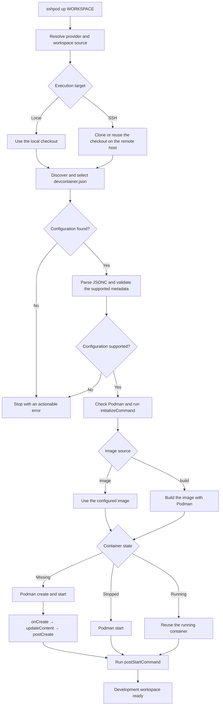

# Quick Start

This page takes a project that already has a `devcontainer.json` and gets its
container running, first with local Podman and then on a remote host over SSH.

You need `sshpod` on your machine ([install](/install)), Podman wherever the
container should run, and Git plus OpenSSH for the remote workflow.

## Local workspace

```sh
sshpod provider add local --type local

cd /path/to/myproject
sshpod up myproject
sshpod
sshpod down myproject
```

The first `up` associates the logical workspace name `myproject` with the current
directory, and stores that binding in the [configuration file](/config). Later
`up`, `list`, and `down` calls can run from anywhere.

`sshpod` with no subcommand is the same as `sshpod list`:

```text
WORKSPACE   PROVIDERS   STATUS
myproject   local       running:local
```

Containers are named deterministically per workspace and provider, so the
container above is `sshpod-myproject-local` and carries the labels
`sshpod.managed`, `sshpod.workspace`, and `sshpod.provider`. Ordinary `podman ps`
finds it.

`down` stops the container without deleting it, so the next `up` restarts the
same one.

## Remote workspace over SSH

Configure an OpenSSH host or alias — anything that already works with `ssh
sandbox` works here, including `~/.ssh/config` aliases:

```sh
sshpod provider add sandbox --type ssh --host sandbox

cd /path/to/a/git-checkout
sshpod up myproject --provider sandbox
sshpod down myproject --provider sandbox
```

sshpod asks the local Git checkout for its `remote.origin.url`, then runs `git
clone` on `sandbox` when the predictable remote workspace directory does not yet
exist. The remote checkout is reused on later starts.

SSH options, identities, proxy jumps, and hostnames remain in `~/.ssh/config`.
sshpod invokes the system `ssh` command and does not implement or duplicate SSH
configuration.

::: warning A local directory is not synchronized to an SSH provider
A remote Git URL is the supported automatic path today. An existing absolute
directory on the remote host can be configured manually — see
[workspace targets](/config#workspaces). Local-to-remote source synchronization
is on the [roadmap](/roadmap), not in this release.
:::

## Choosing a configuration

sshpod searches the specification-defined locations in order:

1. `.devcontainer/devcontainer.json`
2. `.devcontainer.json`
3. `.devcontainer/<folder>/devcontainer.json`

If several nested configurations exist, an interactive terminal prompts for one.
Scripts and other non-interactive callers must select one explicitly:

```sh
sshpod up myproject --config .devcontainer/rust/devcontainer.json
```

The selection is saved for that workspace/provider target, so it only has to be
passed once. If no configuration is found, sshpod stops with an error listing the
checked locations; it does not invent a default environment or launch a
container.

## What `up` actually does



sshpod owns the orchestration layer shown above; Podman remains the container
runtime.

## Next steps

- [Providers](/providers) — local and SSH targets, and what happens when a host is unreachable
- [Dev Containers](/devcontainer) — which `devcontainer.json` properties are interpreted today
- [Configuration](/config) — the YAML file, its location, and its schema
- [CLI](/cli) — every command, flag, and output format
